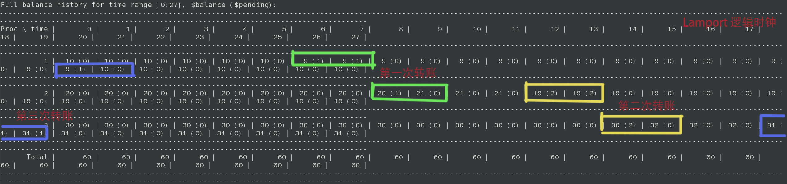

# 分布式银行系统

这是一个用C语言编写的分布式银行系统，可以模拟多个账户之间的转账操作，并记录每个时间点的总金额。该系统使用Lamport的标量时间代替物理时间，来确定事件的顺序和因果关系。

## 程序结构

程序主要由以下几个文件组成：

- main.c：主函数文件，调用其他文件中的函数，并实现了Lamport逻辑时钟的更新和余额状态的记录。
- pa2345.h：头文件，定义了所有的常量、结构体和消息类型。
- common.h：头文件，定义了一些通用的函数和变量。
- ipc.h：头文件，定义了一些进程间通信的函数和变量。
- bank_robbery.c：bank_robbery()的顶层实现，用来向子进程发送转账指令。
- banking.h 定义与银行业务相关的数据结构和功能。

## 程序功能

程序提供了以下功能：

- 转账：父进程可以根据命令行参数或者标准输入，向子进程发送转账指令，包括源账户、目标账户和转账金额。
- 记录：每个子进程可以记录自己的余额状态，并将其打包成一个余额历史记录，并发送给父进程。父进程可以接收所有子进程的余额历史记录，并将其存储在一个AllHistory结构体中，并打印到快照文件中。

## 程序流程

程序采用多进程和管道通信的方式来模拟分布式银行系统。程序运行时，首先解析命令行参数，获取进程数量和初始余额，并打开日志文件。然后创建N个子进程，每个子进程代表一个银行账户。同时创建N*N个管道，用来实现进程间的通信。每个子进程只保留与自己相关的管道，关闭其他管道。父进程也只保留与子进程通信的管道。

程序分为三个阶段：

- 第一阶段：开始运行。每个子进程向其他进程和父进程发送STARTED类型的消息，并记录自己的余额状态。每个子进程也要从其他进程和父进程接收STARTED类型的消息，并更新自己的逻辑时钟和余额状态。父进程也要从所有子进程接收STARTED类型的消息，并打印日志。当所有进程都收到所有其他进程的STARTED类型的消息后，第一阶段结束。
- 第二阶段：转账操作。父进程根据是否有转账指令，向子进程发送TRANSFER或者STOP类型的消息。如果是TRANSFER类型的消息，子进程需要从自己的余额中扣除转账金额，并向目标进程发送TRANSFER类型的消息，并等待接收ACK类型的消息。如果是STOP类型的消息，子进程需要跳转到第三阶段。每个子进程也要从其他进程接收TRANSFER类型的消息，并更新自己的逻辑时钟和余额状态。如果自己是目标进程，需要向父进程发送ACK类型的消息，并增加自己的余额。每次转账操作后，都要记录自己的余额状态。
- 第三阶段：结束运行。每个子进程向其他进程和父进程发送DONE类型的消息，并记录自己的余额状态。每个子进程也要从其他进程接收DONE类型的消息，并更新自己的逻辑时钟和余额状态。父进程也要从所有子进程接收DONE类型的消息，并打印日志。当所有进程都收到所有其他进程的DONE类型的消息后，第三阶段结束。每个子进程将自己的余额历史记录打包成一个BALANCE_HISTORY类型的消息，并发送给父进程。父进程接收所有子进程发送的BALANCE_HISTORY类型的消息，并将余额历史记录存储在一个AllHistory结构体中。最后，父进程调用print_history函数打印快照，并等待所有子进程结束运行。

## 执行过程

1. 链接动态库libruntime.so，执行编译命令：
```
clang -std=c99 -Wall -pedantic *.c -L./lib64 -lruntime -o pa3
```

2. 输入命令（创建3个子账户进程，初始余额分别是10、20、30）:
```
pa3 -p 3 10 20 30  
```

- 在Lamport时钟为6-8时，账户1向账户2转账，金额为1。
- Lamport时钟为12-14时，账户2向账户3转账，金额为2。
- Lamport时钟为18-20时，账户3向账户1转账，金额为1。
   
历史记录如下：



## 程序优化

程序还有一些可以优化的地方，例如：

- 可以使用信号量或者互斥锁来保证管道通信的同步和互斥，避免出现数据丢失或者乱序的情况。
- 可以使用动态内存分配和释放来管理管道和消息缓冲区，避免出现内存泄漏或者溢出的情况。
- 可以使用枚举类型来定义消息类型，避免出现魔法数字或者不一致的情况。
- 可以使用宏定义来定义常量和格式字符串，避免出现重复或者不一致的情况。
