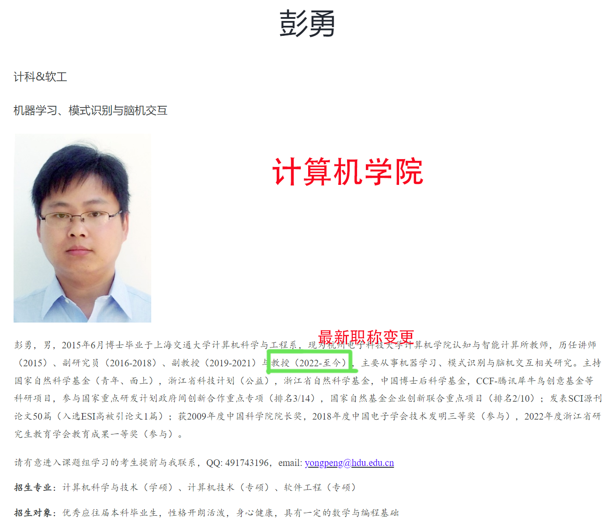
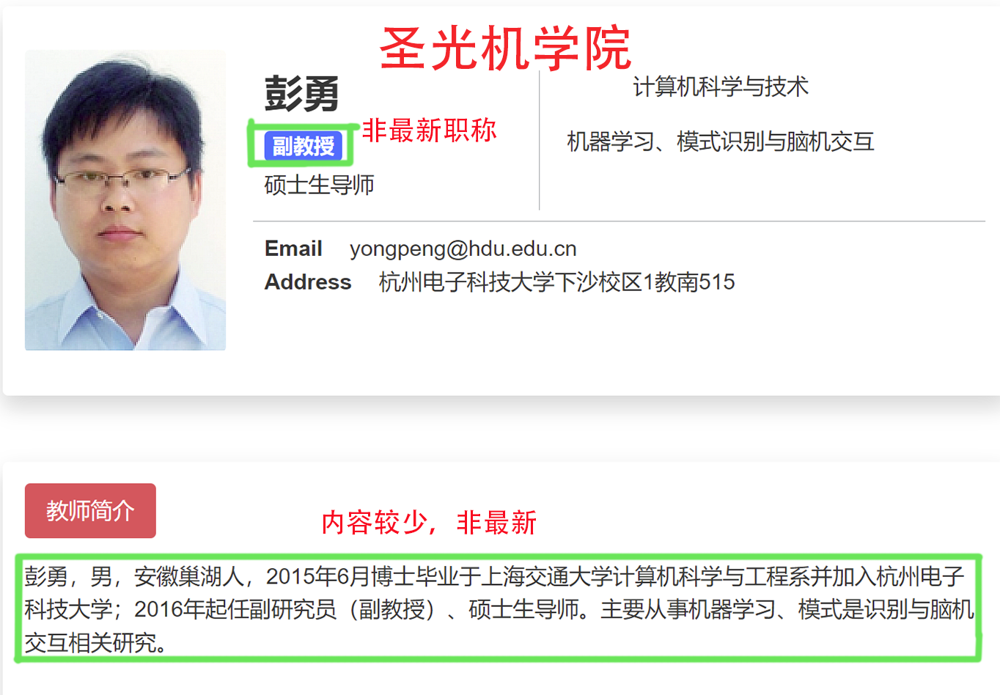
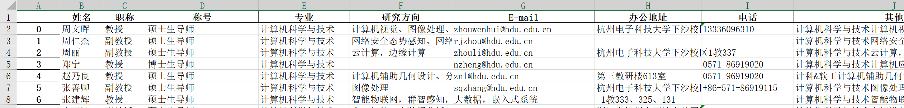

# 教师信息爬虫
这是一个用Python编写的爬虫程序，该程序可以帮助考研复试的同学快速了解不同学院导师的研究方向和联系方式。 
程序从杭州电子科技大学计算机学院和ITMO-Joint学院的网站上抓取两学院共同教师的信息，并保存到Excel文件中。
，可以从杭州电子科技大学计算机学院和ITMO-Joint学院的网站上抓取教师的信息，并保存到Excel文件。

## 需求
在考研复试过程中选导师的时候，发现我所在的圣光机学院和计算机学院的导师信息更新不同步，导致我需要在圣光机学院找到导师的姓名然后在计算机学院的官网上找到对应导师的信息。这种方式的困难之处在于：对于每个圣光机导师，我需要在计算机学院一百多名老师中对应上，这个过程非常枯燥且耗时。通过此爬虫程序，可以快速地收集和整理这些信息，节省人力和时间，提高效率和准确性。
因此，这个程序的用途是为了方便获取和分析杭州电子科技大学计算机学院和ITMO-Joint学院的共同教师的最新情况，比如教师的姓名、职称、专业、研究方向、联系方式等。 
- 以彭勇老师为例，彭勇老师的基本信息在圣光机学院(职称，联系方式等)，但是最新最全的信息更新在计算机学院。

- 最终结果导出到excel表格 

 

## 实现细节

这个程序主要使用了以下几个模块：

- requests：用于发送HTTP请求，获取网页内容
- pandas：用于处理和保存数据
- selenium：用于模拟浏览器操作，获取动态网页内容
- BeautifulSoup：用于解析网页内容，提取所需信息
- numpy：用于处理数组数据
- sys：用于输出进度信息
- logging：用于记录日志信息

程序的主要步骤如下：

1. 定义URL和浏览器驱动路径
2. 定义parser函数，用于解析教师个人主页，提取姓名和其他信息
3. 定义muti_pages函数，用于爬取计算机学院教师列表页，提取教师姓名和个人主页链接
4. 定义muti_run函数，用于爬取计算机学院多个列表页，合并教师信息
5. 定义muti_parser_itmo函数，用于爬取ITMO-Joint教师列表页，提取教师姓名和个人主页链接
6. 定义parser_itmo函数，用于解析ITMO-Joint教师个人主页，提取姓名和其他信息
7. 定义save_to_excel函数，用于将数据保存到Excel文件中
8. 在main函数中调用以上函数，完成爬虫任务

## 使用方法

1. 确保安装了Python 3和所需的模块
2. 确保下载了Chrome浏览器和对应版本的Chrome驱动，并修改CHROME_DRIVER_PATH变量为驱动路径
3. 运行程序，等待爬虫完成
4. 在当前目录下找到生成的Excel文件，查看教师信息

