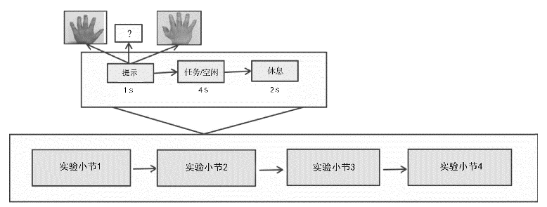
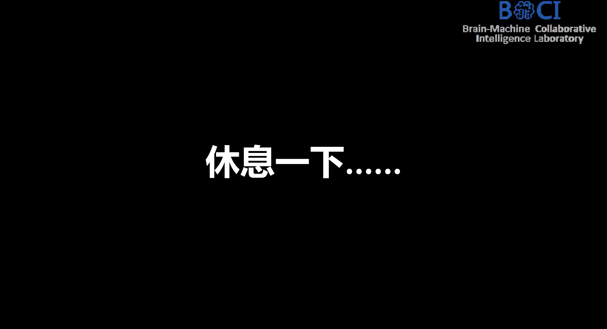
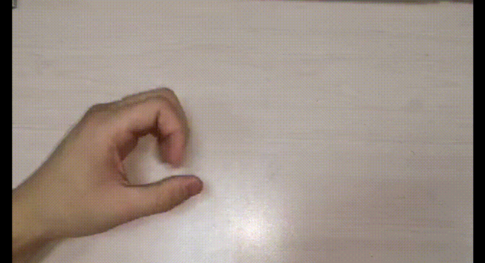
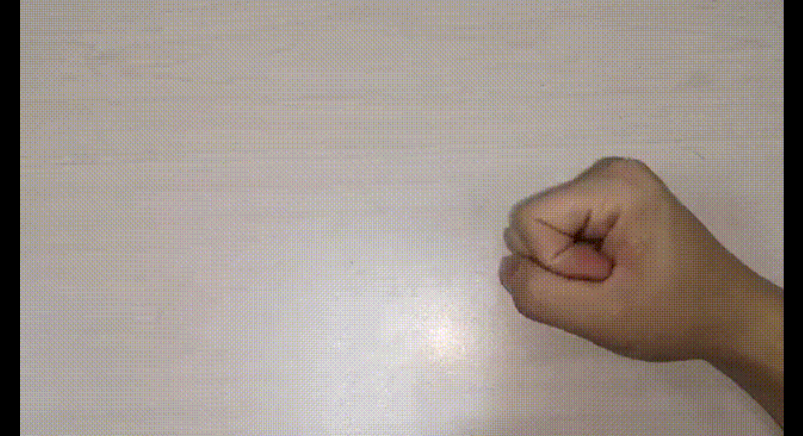

### 运动想象实验

用于进行运动想象实验。实验分为5个session，每个session包含75个试次。代码中使用了reveal.js库来创建幻灯片形式的实验界面，并通过JavaScript控制实验的流程和显示内容。个试次。

### 实验流程

1. 首先，打开实验页面，在开始页面按下空格键即可进入实验。
2. 每个session开始时，页面会自动切换到下一个幻灯片，显示当前session的提示信息。
3. 在每个session中，会依次展示一系列图片，并要求实验参与者想象对应动作。图片根据随机选择的标签显示左手、右手或休息状态。
4. 在图片展示期间，实验参与者需要根据提示想象对应动作，并在脑海中形象地模拟动作的过程。
5. 实验参与者可以通过观察页面上显示的图片来辅助想象。
6. 实验会自动记录每次图片展示时的标签，并存储在输出序列中。
7. 实验过程中会有休息时间，页面会显示休息页面，并在指定时间后自动切换到下一个幻灯片。
8. 实验结束后，可以根据输出序列分析参与者的运动想象结果。

运动想象实验流程  

### 实验截图
被试者进行运动想象 
 

显示左手线索  

显示右手线索  

无线索  
